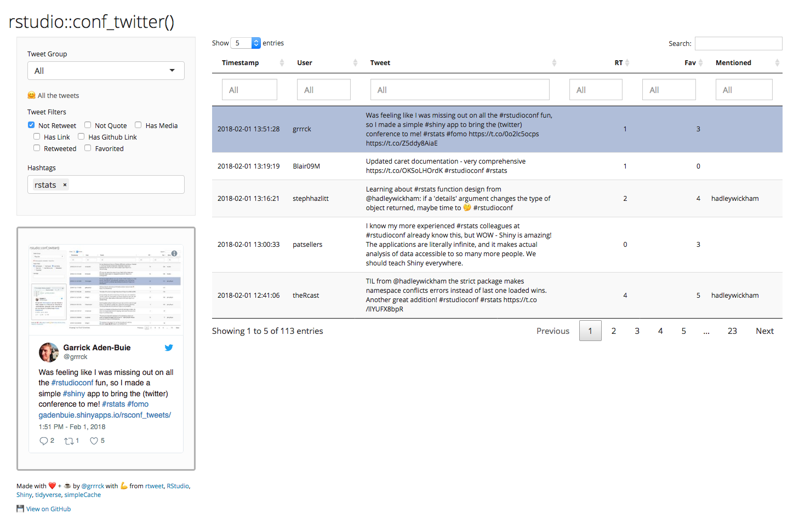

# Tweets from `#user2018`
 
[user2018-conf]: https://user2018.r-project.org/
[app-link]: https://apps.garrickadenbuie.com/user2018-tweets/
[rtweet]: http://rtweet.info/

A quick fix for your [UseR!2018][user2018-conf] FOMO.
Try it online [apps.garrickadenbuie.com/user2018-tweets][app-link] or [run it yourself](#run-this-on-your-own-machine)!

[][app-link]

## Forked from rsconf_tweets()

I forked this from my [Cascadia 2018 tweet explorer](https://apps.garrickadenbuie.com/cascadia-2018-tweets), forked from my [rstatsnyc2018 tweet explorer](https://apps.garrickadenbuie.com/rstatsnyc-2018-tweets/), which was a fork of my [RStudio::conf 2018 tweet explorer](https://github.com/gadenbuie/rsconf_tweets).
Maybe this should be a generic conference tweet app?

Also, shout out to [&commat;APo_ORV](https://twitter.com/APo_ORV) for [his remix of the original rsconf_tweets() app](https://twitter.com/APo_ORV/status/1016412207867973632).


## Run this on your own machine

<!--
UseR!2018 is now over!
This repo now includes the tweets I gathered during the conference, so you do not need to worry about authenticating with Twitter.
You can run the app locally with a simple `shiny::runGitHub("rstatsnyc-2018-tweets", "gadenbuie")`
-->

To run this on your own, you need to create an OAuth twitter token for [`rtweet`][rtweet].
I followed Bob Rudis's ([hrbrmstr](https://twitter.com/hrbrmstr)) excellent guide from [21 Recipes for Mining Twitter with rtweet](https://rud.is/books/21-recipes/).

To have this app recognize your twitter PAT, you have a couple options:

1. You can follow all of the steps in [Using OAuth to Access Twitter APIs](https://rud.is/books/21-recipes/using-oauth-to-access-twitter-apis.html), 

2. You can save your `twitter_token` to `rtweet.rds` in the app directory

3. You can code up another alternative by setting `.TWITTER_PAT` in a file called `twitter_secrets.R`.

(The first one is the best answer.)

### Required packages

I used the following packages to make this, all of which can all be installed from CRAN:

```r
packages = c("shiny", "rtweet", "dplyr", "stringr",
             "purrr", "httr", "DT", "shinythemes", 
             "shinyjs", "glue", "simpleCache")
install.packages(packages)
```

## How it originally worked

I used a simple twitter search for anything tagged or related to ~~`rstudioconf`~~ `rstatsnyc`.
Ininitally I was just looking at anything tagged `#rstudioconf`, but I borrowed the search terms from [Michael Kearney](https://github.com/mkearney/rstudioconf_tweets).

```r
rstudioconf <- c("rstudioconf", "rstudio::conf",
  "rstudioconference", "rstudioconference18",
  "rstudioconference2018", "rstudio18",
  "rstudioconf18", "rstudioconf2018",
  "rstudio::conf18", "rstudio::conf2018")
```

The app is set to pull in new tweets if the app was last loaded more than 15 minutes ago.
To get new tweets, just reload!

Check out [`init.r`](init.R) for more details.
